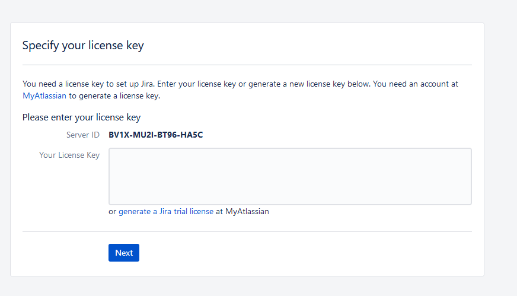

### Install JDK/JRE
```sh
[Linux->Ubuntu 18.04]

sudo apt-get update

sudo apt-get install oracle-java8-installer

choose Mysql or Postgresql 
```
### Install Mysql >=5.7
```sh
[Linux->Ubuntu 18.04]

sudo apt-get update

sudo apt-get install apache2

sudo apt-get install mysql-server libapache2-mod-auth-mysql php5-mysql

sudo apt-get install php5 libapache2-mod-php5 php5-mcrypt
```
### Import data to DB
```sh
CREATE DATABASE jira CHARACTER SET utf8;

GRANT ALL PRIVILEGES ON jira.* TO jira@127.0.0.1 identified by 'ducna';

GRANT ALL PRIVILEGES ON jira.* TO jira@172.18.31.240 identified by 'ducna';

GRANT ALL PRIVILEGES ON jira.* TO jira@lab1 identified by 'ducna';

FLUSH PRIVILEGES;

NOTE: 172.18.31.240 is ip server 
```
### Install Postgresql
```sh
sudo apt install wget ca-certificates

wget --quiet -O - https://www.postgresql.org/media/keys/ACCC4CF8.asc | sudo apt-key add -

sudo sh -c 'echo "deb http://apt.postgresql.org/pub/repos/apt/ $(lsb_release -cs)-pgdg main" >> /etc/apt/sources.
list.d/pgdg.list' 

sudo apt update

apt install postgresql postgresql-contrib
```


###    Add jira user and jira database

```sh
sudo su - postgres
psql
postgres=# create role jira;
CREATE ROLE
postgres=# create database jira;
CREATE DATABASE
postgres=# grant all privileges on database jira to jira;
GRANT
postgres=# alter role jira with password '123456aA@';
ALTER ROLE
postgres=# alter role jira with LOGIN;
ALTER ROLE
postgres=#\q
```

allow connection inbound  from jira user 
```sh
nano /var/lib/pgsql/data/postgresql.conf
listen_addresses = 'x.x.x.x'
```
allow jira account connect
```sh
nano /var/lib/pgsql/data/pg_hba.conf

host    all             jira	x.x.x.x/32                md5
```
############# Install Jira #############

download: 
In website Jira: https://www.atlassian.com/software/jira/download
```sh
Wget https://www.atlassian.com/software/jira/downloads/binary/atlassian-jira-software-8.20.2-x64.bin
./atlassian-jira-software-8.20.2-x64.bin
```
follow instruction to finish setup.

Copy file atlassian-agent.jar  to dir install jira 
config 
```sh
nano jira/bin/setenv.sh 
export JAVA_OPTS="-javaagent:/opt/atlassian/atlassian-agent.jar ${JAVA_OPTS}"
```
restart jira
access WEb UI to get server ID 

 

CMD to gen key active
```sh
java -jar atlassian-agent.jar  -p jira -m tomhelay@gmail.com -n Tom -o http://atlassian.com -s BV1X-MU2I-BT96-HA5C
```
